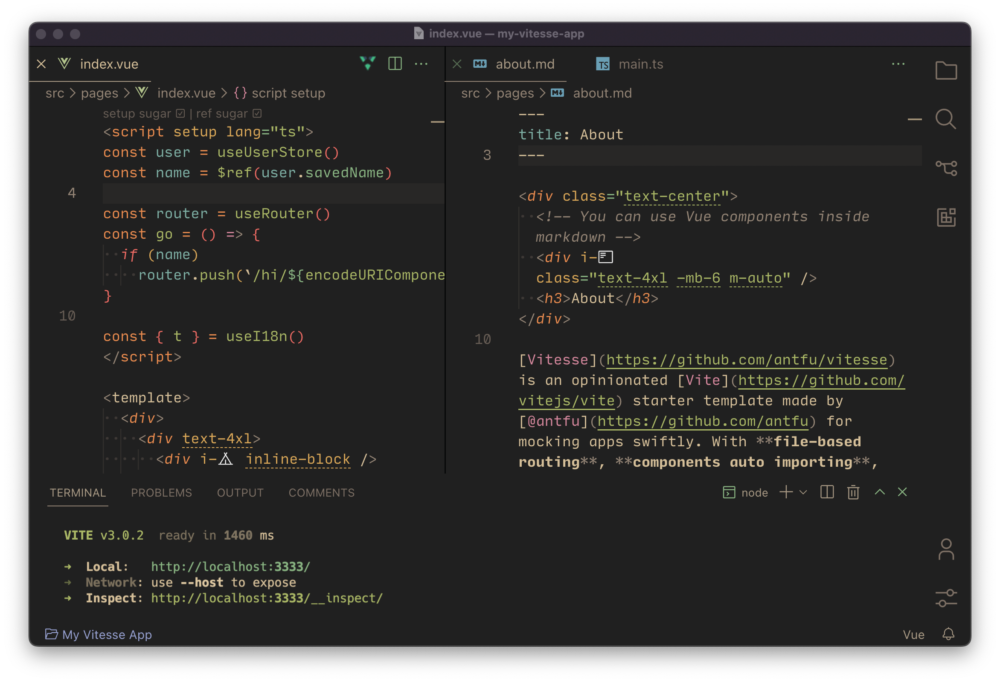
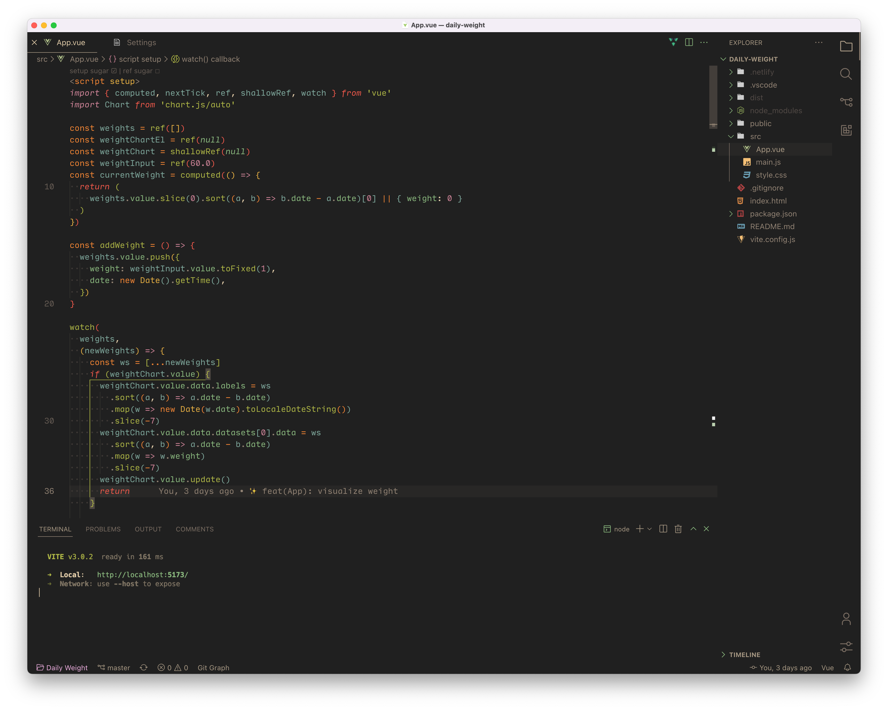

<samp><b>Yuxuan's VS Code Settings</b></samp>

[`.vscode/settings.json`](./.vscode/settings.json) 
[`.vscode/extensions.json`](./.vscode/extensions.json)

 
 

<samp>Preview</samp>

<samp>&nbsp;&nbsp;&nbsp;&nbsp;&nbsp;&nbsp;&nbsp;&nbsp;&nbsp;Theme | <a href="https://marketplace.visualstudio.com/items?itemName=sainnhe.gruvbox-material">Gruvbox Material</a> 
&nbsp;&nbsp;&nbsp;&nbsp;&nbsp;&nbsp;&nbsp;Font | <a href="https://input.djr.com/">Input Mono</a> 
&nbsp;File Icons | <a href="https://marketplace.visualstudio.com/items?itemName=file-icons.file-icons">File Icons</a> 
Product Icons | <a href="https://github.com/antfu/vscode-icons-carbon">Carbon</a>&nbsp;&nbsp;&nbsp;&nbsp;&nbsp;&nbsp;</samp>

 

## LICENSE

MIT
